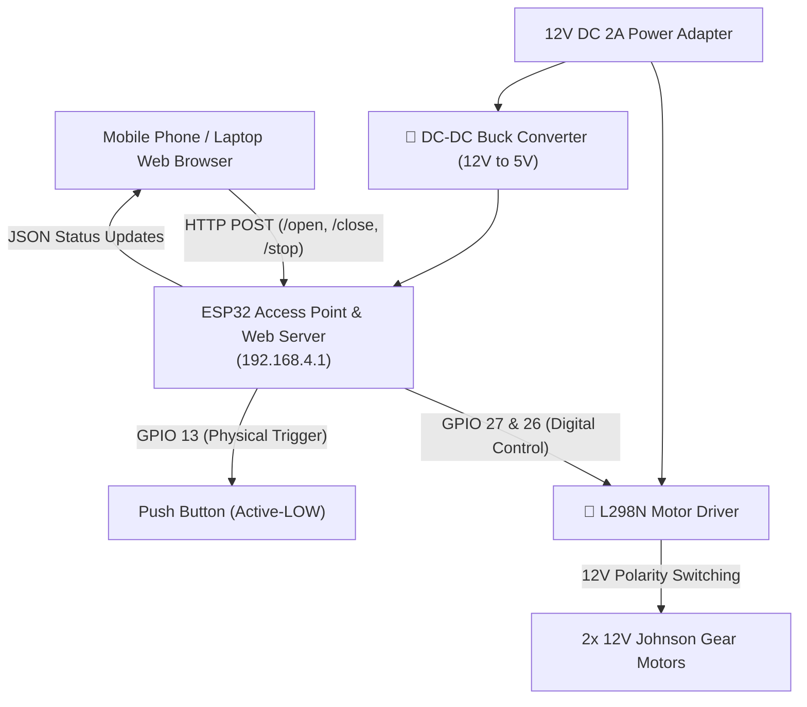

#  IoT Motorized Curtain Control System
### Bhu Pu Sainik Rising Secondary English School
*Rampur-5, Palpa, Nepal*  
**Motto:** *"Come to Learn, Go to Serve"*  
**Accreditation:** ISO 21001:2018 Certified Institution  

---

This repository contains the production-ready firmware and responsive web control dashboard for the **IoT Motorized Curtain Control System**, custom-built for school inauguration and unveiling ceremonies. 

The system leverages an **ESP32** microcontroller acting as an autonomous Wi-Fi Access Point and Captive Portal DNS Server. Users can control the curtain unveiling mechanism wirelessly via any smartphone or laptop without needing an internet connection.

---

##  System Architecture & Data Flow

Below is the hardware topology and control interface data flow:



---

##  Key Features

*   **Wireless Dashboard Control:** A responsive, single-page web dashboard stored in flash memory (`PROGMEM`) using zero externals (no internet connection needed).
*   **Captive Portal DNS:** Automatically redirects any connected Wi-Fi client directly to the curtain control panel (`192.168.4.1`), eliminating manual URL typing.
*   **Non-Blocking State Machine:** Motor state transitions (`IDLE`, `OPENING`, `CLOSING`, `STOPPED`) utilize the non-blocking `millis()` timer. The system remains fully responsive to emergency stop requests during curtain movement.
*   **Persistent Preferences:** Adjustable motor run durations are saved directly to the ESP32's non-volatile storage (Preferences API/Flash) and survive power reboots.
*   **Dual Operation Modes:** Support for wireless browser-based controls and a physical backup push button (GPIO 13) for manual triggers.
*   **Ceremonial 3-Second Countdown:** Optional togglable visual countdown delay in a gold-bordered ceremonial frame, building anticipation for the official unveil.
*   **Offline Simulator Mode:** Built-in web client simulator allowing developers to test CSS styling, layouts, and animations directly in a local browser (e.g., double-clicking `doc/index.html`) without physical ESP32 hardware.

---

##  Hardware Configuration & Wiring Guide

For stable operation, configure the ESP32 Dev Module and L298N H-Bridge Motor Driver as specified below:

### Pin Connections

| ESP32 Pin | L298N / Button | Function Description |
| :--- | :--- | :--- |
| **GPIO 27** | **IN1** | Motor A Direction Control (Connected to IN1) |
| **GPIO 26** | **IN2** | Motor A Direction Control (Connected to IN2) |
| **GPIO 13** | **Button Pin** | Physical push button (other side connected to GND) |
| **GND** | **GND** | Common Ground *(Tie ESP32 GND and L298N GND together)* |
| **5V / VIN** | **5V Out (Buck)** | 5V Power supply input for the ESP32 |

> [!IMPORTANT]
> **Common Ground Requirement**  
> You **MUST** connect the ground (GND) of the ESP32 Dev Module to the ground (GND) terminal of the L298N Motor Driver. Without a common ground reference, floating digital control lines will cause unpredictable motor stuttering or command failures.

> [!NOTE]
> **Enable Pins (ENA / ENB)**  
> This setup assumes the L298N driver board has the default factory jumpers in place on the **ENA** and **ENB** pins, tying them to `HIGH` (enabled). If you have removed these jumpers, wire them to the ESP32 3.3V rail or digital output pins driven `HIGH` to enable motor driving.

---

##  File Directory

*   **[`code/parda/parda.ino`](file:///d:/parda/code/parda/parda.ino)**: The main Arduino sketch containing the ESP32 Wi-Fi setup, Captive Portal DNS configuration, HTTP Server endpoints, and the non-blocking hardware control state machine.
*   **[`code/parda/html.h`](file:///d:/parda/code/parda/html.h)**: Houses the minified, responsive UI dashboard string stored in Flash (`PROGMEM`) using raw literal HTML/CSS/Javascript.
*   **[`doc/index.html`](file:///d:/parda/doc/index.html)**: The standalone frontend development template, including simulated mock API endpoints for rapid visual and layout testing.
*   **[`doc/readme.md`](file:///d:/parda/doc/readme.md)**: Supplementary system walkthrough highlighting UI/UX responsiveness and touch-target optimization.

---

## Compilation & Deployment

### 1. Arduino IDE Setup
1. Open the **Arduino IDE**.
2. Open the preferences page and add the ESP32 package URL to the *Additional Boards Manager URLs*:
   ```text
   https://raw.githubusercontent.com/espressif/arduino-esp32/gh-pages/package_esp32_index.json
   ```
3. Go to **Tools > Board > Boards Manager**, search for `esp32` by Espressif, and install the library.
4. Select the target board: **Tools > Board > ESP32 Arduino > ESP32 Dev Module**.

### 2. Flash the Firmware
1. Navigate to the [`code/parda/`](file:///d:/parda/code/parda) folder.
2. Open [`parda.ino`](file:///d:/parda/code/parda/parda.ino) in the Arduino IDE. Both `parda.ino` and `html.h` must reside in the same folder.
3. Connect your ESP32 board to the PC via a USB cable.
4. Select the matching COM Port under **Tools > Port**.
5. Click **Upload** to compile and transfer the program to the board.

---

##  How to Operate the System

1.  **Power Up:** Connect the 12V DC power adapter to the system. The ESP32 and L298N status LEDs will light up.
2.  **Connect to Wi-Fi:** On a mobile phone or laptop, scan for Wi-Fi networks and connect to:
    *   **SSID:** `INAUGURATION-BHU-PU`
    *   **Password:** *None (Open AP Hotspot)*
3.  **Access Dashboard:** Open your web browser. A captive portal page should automatically open. If it does not appear, type `192.168.4.1` into the address bar.
4.  **Perform Unveiling:**
    *   **Open Curtain:** Tap **Open Curtain**. If the *Ceremonial 3s Delay* box is checked, a dramatic gold-framed fullscreen countdown (3... 2... 1... GO!) will occur before the motors engage.
    *   **Close Curtain:** Tap **Close Curtain** to rewind the cords and close the curtains back.
    *   **Emergency Stop:** Tap **Emergency Stop** at any time to immediately cut power to the motors.
    *   **Timing Control:** Use the slider to set the motor running time (between 3.0 and 20.0 seconds). The selected duration is sent to the ESP32 via AJAX and stored permanently.
5.  **Physical Push Button:** For backup manual control, pressing the physical push button connected to GPIO 13 triggers the motor to open for the configured duration.

---

##  Credits & Development

*   **Lead Hardware/Software Architect:** Sakhyam Bastakoti  
*   **Institution:** Bhu Pu Sainik Rising Secondary English School, Rampur-5, Palpa, Nepal  

---
*Created for memorable, secure, and spectacular institutional inaugurations.*
