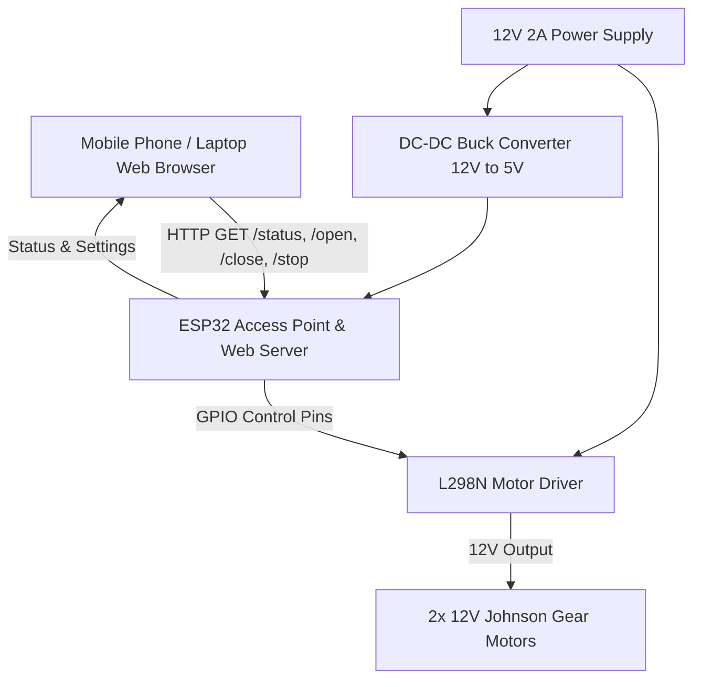

# ESP32 IoT Inauguration Curtain Control System

A production-ready embedded and web-controlled system running on an ESP32, designed to control a motorized curtain unveiling mechanism for the inauguration ceremony at **Bhu Pu Sainik Rising Secondary English School**.

## Proposed Architecture

## User Review Required

> [!IMPORTANT]
> **GPIO Pin Configuration Verification**
> The default pin configuration is set as follows. Please verify if your physical board requires different wiring:
> - **IN1** -> GPIO 26
> - **IN2** -> GPIO 27
> - **IN3** -> GPIO 14
> - **IN4** -> GPIO 12
> - **ENA** -> GPIO 25 (Controls speed/enable for Motor A)
> - **ENB** -> GPIO 33 (Controls speed/enable for Motor B)
> 
> If the L298N driver has jumpers on ENA/ENB, they must be removed, and GPIO 25/33 should be wired to these pins to control enablement. Alternatively, if ENA/ENB jumpers are kept in place (meaning enable is permanently high), we can leave GPIO 25 and 33 unconnected, but using GPIO control is safer as it allows disabling the driver completely when idle. We will implement support for both.

> [!WARNING]
> **Non-blocking Timing & Safety**
> - The motor control will be **fully non-blocking** (using `millis()`). If a `/stop` command is received, the motors will halt immediately.
> - An automatic timeout (adjustable in UI, default 8 seconds) will turn off all motor outputs to prevent overheating and physical rope strain.
> - During start-up, all motor control pins will be explicitly set to `LOW` to prevent initial motor twitches.

## Proposed Changes

### 1. Prototype Web Interface
#### [NEW] [index.html](file:///d:/parda/index.html)
We will create a standalone frontend prototype file (`index.html`) in the workspace. This file will contain:
- A premium CSS theme featuring school branding (Green `#0f9d58`, `#1b5e20`, gold highlights, glassmorphic card design).
- A virtual simulated curtain split-screen animation (with left and right velvet curtains sliding open to reveal the golden school details).
- Control buttons for OPEN, CLOSE, and STOP with status-specific glowing shadows.
- Configuration controls for motor duration (stored in ESP32 memory/EEPROM).
- A togglable "3s Ceremonial Countdown" that delays the request with a visual countdown overlay.
- Simulated API calls so we can test the UI in the browser tool before uploading to the ESP32.

### 2. ESP32 Embedded Application
#### [NEW] [parda.ino](file:///d:/parda/parda.ino)
The main Arduino sketch containing:
- WiFi Access Point setup:
  - **SSID**: `INAUGURATION-BHU-PU`
  - **Password**: `12345678`
  - **IP**: `192.168.4.1`
- DNS Server mapping `*` to `192.168.4.1` (to implement a rudimentary captive portal so any request redirects to the dashboard).
- ESP32 WebServer endpoints:
  - `GET /` -> Serves the minified HTML, CSS, and JS web page.
  - `POST /open` or `GET /open` -> Set motor state to OPENING, start timer.
  - `POST /close` or `GET /close` -> Set motor state to CLOSING, start timer.
  - `POST /stop` or `GET /stop` -> Set motor state to IDLE immediately, stop motors.
  - `GET /status` -> Returns JSON of the current state, duration configuration, and remaining motor time.
  - `POST /set_duration?seconds=X` -> Configures motor run duration (saved in EEPROM/Preferences to survive power cycles).
- Non-blocking state machine in `loop()` to control driver pins and monitor timeout.

---

## Verification Plan

### Automated/Simulated Verification
1. **Web UI Render Test**: Open [index.html](file:///d:/parda/index.html) using the browser subagent to verify color harmony, layout responsiveness, CSS glassmorphism, split-curtain animation, and countdown overlay.
2. **Interactive UI Verification**: Simulate the click actions (Open, Close, Stop) to verify that state updates correctly.

### Manual Verification (On physical ESP32)
1. Flash the generated `parda.ino` code to the ESP32 via Arduino IDE.
2. Connect a phone or PC to the `INAUGURATION-BHU-PU` WiFi hotspot.
3. Open `192.168.4.1` in the browser.
4. Verify clicking **OPEN** moves the motors for the set duration (indicated by status LEDs on L298N) and stops automatically.
5. Verify clicking **STOP** cancels movement mid-run.
6. Adjust the motor timing slider in the web interface and verify it persists after an ESP32 reboot.
